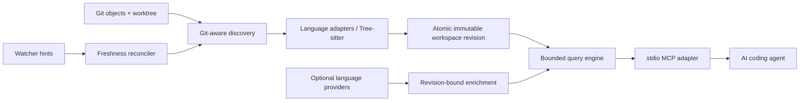

# Chakra

[](https://github.com/crystaldaking/crystal-chakra/actions/workflows/ci.yml)
[](https://github.com/crystaldaking/crystal-chakra/releases)
[](LICENSE)

**Local, current code intelligence for AI coding agents.**

Chakra turns one materialized Git worktree into a compact, structured graph
that agents can query over MCP. It answers questions about repository shape,
symbols, callers, source context, tests, and current changes without uploading
code or requiring an AI, embedding, analytics, or database service.

Chakra is designed for the gap between text search and a full IDE:

- Git and the worktree remain the source of truth.
- Fresh queries see edits immediately, without an arbitrary client sleep.
- Every result identifies its workspace revision, freshness, provenance, and
  precision (`precise`, `syntax`, `heuristic`, or `textual`).
- Tree-sitter provides an offline baseline; optional language servers add
  revision-bound precise evidence and degrade safely when unavailable.
- Responses, queues, indexing, subprocesses, and background work are bounded.

## Language support

All supported languages have Git-aware discovery, Tree-sitter syntax facts,
live reconciliation, the shared query contract, conformance fixtures, and
pinned public-corpus evidence.

| Language | Offline syntax | Optional precise enrichment |
|---|---|---|
| Rust | Tree-sitter | rust-analyzer |
| PHP | Tree-sitter + deterministic Laravel facts | Chakra resolver |
| TypeScript / TSX | Tree-sitter | vtsls |
| JavaScript / JSX | Tree-sitter | vtsls |
| Python | Tree-sitter | pyright |
| Java | Tree-sitter | jdtls |
| C# | Tree-sitter | csharp-ls |
| Shell | Tree-sitter | bash-language-server references |
| C / C++ | Tree-sitter | clangd |
| HCL / Terraform | Tree-sitter | terraform-ls references |
| Go | Tree-sitter | gopls |

The generated [support matrix](docs/support/SUPPORT_MATRIX.md) records the
capability-level evidence. Language-specific behavior and honest limitations
live under [docs/languages](docs/languages/).

## Install from source

Requirements:

- Git on `PATH`;
- [rustup](https://rustup.rs/) to build the pinned Rust 1.97.1 toolchain.

```sh
git clone https://github.com/crystaldaking/crystal-chakra.git
cd crystal-chakra
git checkout v0.1.2
cargo install --locked --path crates/chakra-cli
chakra --version
```

The Cargo package is `chakra-cli`; the executable is `chakra`. Optional
language servers are discovered only when their language route is activated.
They are not required for indexing or syntax queries, and Chakra never installs
them automatically.

For a deterministic syntax-only service, disable any provider with its
`--no-*` flag. Run `chakra serve --help` for executable paths, provider-pool
budgets, index budgets, and watcher startup controls.

## Quick start with an MCP client

Chakra is a stdio MCP server. The client normally owns its process:

```sh
chakra serve --repo /absolute/path/to/a/git-worktree
```

Stdout is reserved for MCP. Logs go to stderr and can be adjusted with
`RUST_LOG`.

With [Codex CLI](https://developers.openai.com/codex/mcp/):

```sh
codex mcp add chakra -- chakra serve --repo /absolute/path/to/repository
codex mcp list
```

Equivalent `~/.codex/config.toml` configuration:

```toml
[mcp_servers.chakra]
command = "/absolute/path/to/chakra"
args = ["serve", "--repo", "/absolute/path/to/repository"]
startup_timeout_sec = 60
tool_timeout_sec = 60
```

Start an agent session with `status`, then use `repo_map` to understand the
workspace before narrowing through symbols and relationships.

## MCP tools

| Tool | What it returns |
|---|---|
| `status` | Revision, freshness, coverage, diagnostics, budgets, provider state, and operational metrics |
| `repo_map` | A bounded structural overview and paginated file inventory |
| `search` | Bounded textual matches in captured source |
| `symbol_search` | Ranked, filterable declarations with stable revision-local identities |
| `context` | One symbol, source excerpt, callers, callees, implementations, tests, and typed related facts |
| `callers` | Aggregated incoming relations plus unresolved syntax evidence |
| `diff_context` | Git/worktree changes joined with current symbols, callers, tests, and call candidates |

Names are never guessed away. If a name is ambiguous, use the `id` and
`revision` returned by `symbol_search`. All collections and source excerpts are
bounded; truncated responses say which section and budget caused the cut.

For branch review, `diff_context` supports direct base and merge-base scopes:

```json
{"scope":{"kind":"merge_base","reference":"origin/develop"},"limit":50}
```

## Freshness and trust model

Filesystem notifications are hints, not truth. A fresh query reconciles a
Git-aware inventory and strong filesystem identities before publishing or
using a revision. An edit, atomic save, rename, deletion, or project-metadata
change is therefore visible without asking the client to wait and retry.

Syntax state is published atomically: a query sees the old complete revision
or the new complete revision, never a partially updated graph. Normal file
changes reparse affected files and relationship owners rather than rebuilding
the repository.

Optional providers are lazy, capacity-bounded adapters. Chakra synchronizes
source and project-input deltas, waits only within explicit budgets, and
accepts precise facts only when the provider result and materialized worktree
still match the pinned revision. Missing executables, crashes, timeouts,
cancellation, or saturation preserve current syntax results with an explicit
fallback reason.

## Architecture



MCP and language servers are adapters; domain and query layers do not depend
on their protocol types. The graph is in memory and rebuilt deterministically
at startup. See the [SPEC](docs/SPEC.md), [v0.1 roadmap](docs/roadmap/v0.1.md),
and [ADRs](docs/adr/) for the full contract and trade-offs.

## Evidence and validation

The shared conformance harness runs the same behavior catalog for every
language. A separate opt-in evaluation runs against 19 pinned public
repositories, including Kubernetes, VS Code, Kafka, Spring Boot, Django,
Symfony, Tokio, and the .NET runtime. Results and machine-readable artifacts
are in [docs/support/corpus](docs/support/corpus/).

Repository validation:

```sh
cargo fmt --all -- --check
cargo clippy --locked --workspace --all-targets -- -D warnings
cargo test --locked --workspace
cargo deny check
```

CI also builds the release workspace, runs the generated multi-language scale
gate, verifies support artifacts, and exercises the native macOS watcher path.

## Project status and limits

Chakra v0.1.x serves one repository and one active materialized worktree per
process. It deliberately does not provide persistent graph restoration,
historical commit materialization, cross-repository graphs, semantic/vector
search, an eager complete precise call graph, arbitrary command execution, or
a web UI.

Syntax intelligence is intentionally conservative. Dynamic dispatch, macros,
generated code, build-configuration selection, framework magic, and incomplete
provider project models can leave candidates unresolved or ambiguous; Chakra
reports that uncertainty instead of upgrading it silently.

## Contributing

Read [CONTRIBUTING.md](CONTRIBUTING.md) for the Gitflow, review, validation,
and release process. Architectural changes should start from the relevant ADR;
bugs and dogfooding findings belong in
[GitHub Issues](https://github.com/crystaldaking/crystal-chakra/issues) with the
query/input, workspace revision, expected result, actual result, and fallback
evidence needed to reproduce them.

Chakra is available under the [MIT License](LICENSE).
