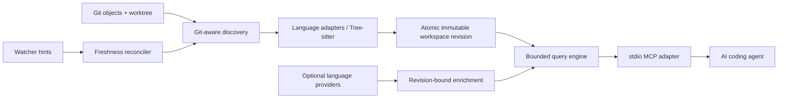

# Chakra

[](https://github.com/crystaldaking/crystal-chakra/actions/workflows/ci.yml)
[](https://github.com/crystaldaking/crystal-chakra/releases)
[](LICENSE)

**Local, current code intelligence for AI coding agents.**

This checkout documents **0.4.0 in release preparation**. The latest published
release is [0.3.2](https://github.com/crystaldaking/crystal-chakra/releases/tag/v0.3.2).
Build this prepared checkout to try the 0.4.0 setup, diagnostics, and Kotlin
features; the 0.4.0 archives are not published yet.

Chakra turns one materialized Git worktree into a compact, structured graph
that agents can query over MCP. It answers questions about repository shape,
symbols, callers, source context, tests, and current changes without uploading
code or requiring an AI, embedding, analytics, or database service.

Chakra is designed for the gap between text search and a full IDE:

- Git and the worktree remain the source of truth.
- Fresh queries see edits immediately, without an arbitrary client sleep.
- Every result identifies its workspace revision, freshness, provenance, and
  precision (`precise`, `syntax`, `heuristic`, or `textual`).
- Tree-sitter provides an offline baseline; optional language servers add
  revision-bound precise evidence and degrade safely when unavailable.
- Responses, queues, indexing, subprocesses, and background work are bounded.

## Language support

All supported languages have Git-aware discovery, Tree-sitter syntax facts,
live reconciliation, the shared query contract, conformance fixtures, and
pinned public-corpus evidence.

| Language | Offline syntax | Optional precise enrichment |
|---|---|---|
| Rust | Tree-sitter | rust-analyzer |
| PHP | Tree-sitter + deterministic Laravel facts | Chakra resolver |
| TypeScript / TSX | Tree-sitter | vtsls |
| JavaScript / JSX | Tree-sitter | vtsls |
| Python | Tree-sitter | pyright |
| Java | Tree-sitter | jdtls |
| C# | Tree-sitter | csharp-ls |
| Shell | Tree-sitter | bash-language-server references |
| C / C++ | Tree-sitter | clangd |
| HCL / Terraform | Tree-sitter | terraform-ls references |
| Go | Tree-sitter | gopls |

The generated [support matrix](docs/support/SUPPORT_MATRIX.md) records the
capability-level evidence. Language-specific behavior and honest limitations
live under [docs/languages](docs/languages/).

Kotlin is available in this checkout as an **in-progress** addition: offline
syntax, 14/14 conformance scenarios, and recorded public-corpus results are
present. Real-server scenarios for Maven, Gradle JVM, mixed Kotlin/Java,
Android and Multiplatform have passed in the pinned Docker environment.
Native Windows and final candidate validation remain incomplete, so Kotlin
is not yet advertised as first-class. See
[Kotlin support](docs/languages/kotlin.md) for setup and remaining limitations.

## Install

### 0.4.0 installers

The installers in this checkout verify release archives against `SHA256SUMS`
and add `chakra` to PATH. **The following download commands become available
after the 0.4.0 release is published**; for now, use the published archives
below or build this checkout from source.

```sh
curl -fsSL https://github.com/crystaldaking/crystal-chakra/releases/latest/download/install.sh | sh
```

```powershell
irm https://github.com/crystaldaking/crystal-chakra/releases/latest/download/install.ps1 | iex
```

The release bundle includes both installer scripts in `SHA256SUMS` and its
build-provenance attestation. To verify a script before executing it, download
it and `SHA256SUMS` from the same versioned release and check its manifest
entry, as described for archives below. The piped commands above execute the
download directly.

The installer covers Linux x86-64, macOS Apple silicon and Intel, and
Windows x86-64, and rejects other platforms before changing anything. It
installs into a user-owned directory (`~/.local/bin`,
`%LOCALAPPDATA%\Programs\chakra`) — no administrator rights needed.
Without an explicit version, the installer selects GitHub's latest stable
release. Options differ by shell:

| Purpose | Unix | PowerShell |
|---|---|---|
| Select a version (required for downgrades) | `--version vX.Y.Z` | `-Version vX.Y.Z` |
| Choose the install directory | `--dir PATH` | `-Dir PATH` |
| Skip PATH changes | `--no-path-modify` | `-NoPathModify` |

Pass options to a saved installer script. PATH changes are idempotent (a managed
shell block on Unix, the user PATH on Windows) and take effect in a new
terminal; the installer never claims to modify the parent shell. Re-running
upgrades through the same verified download flow, and a failed download or
checksum check leaves any previous installation usable. The candidate must
also run successfully and report the exact requested version before it
replaces the previous binary.

Removal: first run `chakra init --agent <client> --remove` per project and
client if you set up agent integration. Then delete the installed binary
(`chakra`/`chakra.exe`) and remove the
`# >>> chakra path >>>` block from your shell startup file or the install
directory from the Windows user PATH. Registered MCP clients use a replaced
binary when they next start the server because registration points at the
install path. Restart an existing agent/server session after upgrading.

### Prebuilt release archives

[Chakra v0.3.2](https://github.com/crystaldaking/crystal-chakra/releases/tag/v0.3.2)
provides the currently published native archives. The 0.4.0 release workflow
targets the same platforms:

| Platform | Target | Archive |
|---|---|---|
| Linux x86-64 (glibc) | `x86_64-unknown-linux-gnu` | `.tar.gz` |
| macOS Apple silicon | `aarch64-apple-darwin` | `.tar.gz` |
| macOS Intel | `x86_64-apple-darwin` | `.tar.gz` |
| Windows x86-64 | `x86_64-pc-windows-msvc` | `.zip` |

Archive names have the form `chakra-vX.Y.Z-<target>.<format>`. Each contains
the `chakra` executable, a README, and the MIT license in a versioned
directory. Download `SHA256SUMS` from the same release and verify the archive
before installing it. For example, on Linux:

```sh
version=v0.3.2
target=x86_64-unknown-linux-gnu
archive="chakra-${version}-${target}.tar.gz"
base="https://github.com/crystaldaking/crystal-chakra/releases/download/${version}"
curl -fLO "${base}/${archive}"
curl -fLO "${base}/SHA256SUMS"
grep " ${archive}$" SHA256SUMS | sha256sum --check -
tar -xzf "${archive}"
sudo install -m 0755 "chakra-${version}-${target}/chakra" /usr/local/bin/chakra
chakra --version
```

On macOS, choose `aarch64-apple-darwin` for Apple silicon or
`x86_64-apple-darwin` for Intel and verify with
`grep " ${archive}$" SHA256SUMS | shasum -a 256 --check -`. On Windows, compare
`(Get-FileHash <archive> -Algorithm SHA256).Hash` with the matching
`SHA256SUMS` entry, expand the zip, and put the directory containing
`chakra.exe` on `PATH`.

GitHub also publishes signed build-provenance attestations for every archive:

```sh
gh attestation verify "${archive}" --repo crystaldaking/crystal-chakra
```

The binaries are not yet platform code-signed or Apple-notarized. Use the
attestation to verify their GitHub Actions provenance, or build from source if
your local policy requires a signed executable.

### Build from source

Requirements:

- Git on `PATH`;
- [rustup](https://rustup.rs/) to build the pinned Rust 1.97.1 toolchain.

From the root of this prepared 0.4.0 checkout:

```sh
cargo install --locked --path crates/chakra-cli
chakra --version  # chakra 0.4.0
```

For released source, clone the repository and check out the published
`v0.3.2` tag instead; it does not contain the new 0.4.0 commands. A local
0.4.0 tag from preparation is not a published release or a guarantee that
it contains the latest release-branch fixes.

The Cargo package is `chakra-cli`; the executable is `chakra`. Optional
language servers are discovered only when their language route is activated.
They are not required for indexing or syntax queries, and Chakra never installs
them automatically.

For a deterministic syntax-only service, disable any provider with its
`--no-*` flag. Run `chakra serve --help` for executable paths, provider-pool
budgets, index budgets, and watcher startup controls.

## Quick start with an MCP client

With the 0.4.0 binary, configure the project once for each selected client:

```sh
chakra init --repo /absolute/path/to/repository --agent codex
chakra doctor --repo /absolute/path/to/repository --agent codex
```

Use `claude`, `cursor`, or `opencode` for the other setup adapters, or repeat
`--agent` for several clients. Start a new agent session after setup and
complete the client's trust/permission prompts. Setup installs both an MCP
registration and workflow instructions; whether a client follows those
instructions still needs the real-session evidence recorded in the
[client matrix](docs/support/agent-clients.md).

Other MCP-capable clients can register the stdio server manually. The client
normally owns its process:

```sh
chakra serve --repo /absolute/path/to/a/git-worktree
```

Stdout is reserved for MCP. Logs go to stderr and can be adjusted with
`RUST_LOG`. For example, a manual Codex project registration in
`.codex/config.toml` is:

```toml
[mcp_servers.chakra]
command = "/absolute/path/to/chakra"
args = ["serve", "--repo", "/absolute/path/to/repository"]
startup_timeout_sec = 60
tool_timeout_sec = 60
```

Start an agent session with `status`, then use `repo_map` to understand the
workspace before narrowing through symbols and relationships.

## Project configuration

A project can keep one shared, committed `chakra.toml` at its Git worktree
root instead of repeating Chakra flags in every client's MCP registration
(ADR-0053). Every supported `serve` option for provider enablement, indexing
limits, provider-pool limits, and startup budgets is configurable; see the
commented example at `docs/examples/chakra.toml`.

Configuration is loaded once at startup (restart to change it) and merges in
this order, per key:

1. built-in defaults,
2. the shared `chakra.toml` at the worktree root,
3. a private, non-committed `chakra.local.toml` next to it (add it to your
   project's `.gitignore`),
4. explicit `chakra serve` CLI options.

The shared file is portable: it is discovered at the Git worktree root (never
above it, so nested directories cannot inherit an unrelated project's
settings), and it cannot select provider executables — a `path` key there is
rejected. Machine-specific executable overrides belong to
`chakra.local.toml` or CLI flags; relative paths resolve against the
directory of the file that declares them. `--config PATH` selects the shared
file explicitly and takes its private sibling.

When several worktrees are registered, each one reads its own checked-out
`chakra.toml` for workspace-scoped settings (index budgets and the live
startup timeout); process-global settings (provider-pool limits, provider
enablement and paths, the workspace limit) come from the primary `--repo`
worktree, and an explicit `--config` applies to every registered worktree.

The private file must stay out of version control: if Git tracks
`chakra.local.toml`, startup fails, because a committed repository must never
select provider executables. Configuration files must be regular files (no
FIFOs or device links), at most 1 MiB, and a dangling configuration symlink
is an error — never a silent fallback to defaults.

Inspect the merged result and the source layer of every key without starting
a server:

```sh
chakra config show --repo /path/to/worktree
```

Invalid configuration — malformed TOML, unknown keys, an unsupported
`schema_version`, zero limits — fails startup with an actionable error naming
the file and key; a partially parsed configuration is never applied.

## Agent setup

One-time project setup registers Chakra as a local stdio MCP server and
installs a concise instruction block for a supported coding-agent client
(ADR-0055):

```sh
chakra init --agent claude          # also: codex, cursor, opencode
chakra init --agent codex --agent cursor   # name each client explicitly
chakra init --agent claude --dry-run       # preview every planned write
chakra init --agent claude --remove        # revert Chakra-owned setup
```

Setup is idempotent and preserves user work: it owns only the `chakra` MCP
entry, a delimited `<!-- chakra:begin/end -->` instruction block, and a
minimal `chakra.toml` created only when none exists. Matching registrations
retain environment, timeout, and enablement options byte-for-byte; setup
does not re-enable a deliberately disabled entry. Conflicting
registrations and malformed blocks stop setup with an actionable message
instead of overwriting anything. See `docs/support/agent-clients.md` for
the pinned per-client formats and current evidence status, and run
`chakra doctor --agent <client>` to diagnose registration, instructions,
and project configuration. Removal preserves shared `AGENTS.md` instructions
while another supported client still has a `chakra` registration, including
a disabled one. The last registration's removal strips the managed block;
`chakra.toml` remains in place. `chakra serve` never edits client setup.

`chakra doctor` also explains analysis quality (issue #207): per provider
it reports intentional syntax-only disablement, missing or misconfigured
executables with install guidance per `docs/languages/*.md`, missing
project metadata at the worktree root, and index-budget pressure from the
tracked source inventory — always labeled as an *isolated inspection*,
never as the agent's live session (dormant/catching-up/ready/degraded
states and live counters belong to the session's `status` tool). The
default run uses Git for repository inspection but does not launch language
servers; `--probe` adds bounded provider `--version`
executions with hard deadlines and pinned-version compatibility findings,
and `--json` emits the versioned machine-readable document. Exit status
`1` marks broken setup; an intentionally disabled provider is healthy.

For reproducible issue reports, `chakra doctor --report <path>` writes a
bounded, sanitized JSON document (issue #208): findings, platform,
non-sensitive effective limits, provider readiness, and the HEAD revision,
built from an explicit allowlist — no source text, environment values,
credentials, remote URLs, or absolute machine paths — with unavailable
values marked as such. Raw MCP registration values and configuration-parser
excerpts are replaced with report-only summaries. Reports retain at most
200 findings, 2 KiB per text field, and 256 KiB overall; shortened fields
carry a truncation marker, and dropped findings are recorded separately.
Existing reports require `--force` to replace. The final file has mode `0600`
on Unix; Windows uses the destination directory's inherited permissions.
Reports are never uploaded; review the file before sharing it.

`doctor --json` is the detailed local diagnostic format and **does not use
the report sanitizer**. Use `--report` for a file intended for sharing. Both
describe isolated observations; query `status` for the live agent session.

## Update checks

`chakra update --check` queries GitHub for the latest stable release and
prints the installed version, the newest version with its release notes, and
the supported upgrade path (ADR-0054). Exit status is part of the contract:
`0` up to date, `1` check unavailable, `2` update available with a matching
platform asset.

After `chakra serve` starts, it makes one gated background-check attempt.
The persisted gate allows a check at most once per 24 hours per state
directory, with failure backoff. There is no periodic polling loop within
that process. An available update is reported to stderr only — never to
MCP clients, never blocking startup or queries. Disable automatic checks with
`CHAKRA_UPDATE_CHECK=0` or `[update] automatic = false` in
`chakra.local.toml` (private-only, so a committed repository cannot
re-enable them). Checking never downloads or replaces the binary; upgrades
happen only through the explicit installer flow. `CHAKRA_UPDATE_CHECK=false`
and `off` also disable automatic checks; the explicit `update --check`
command remains available regardless of automatic-check opt-out.

## MCP tools

| Tool | What it returns |
|---|---|
| `status` | Revision, freshness, coverage, diagnostics, budgets, provider state, and operational metrics |
| `repo_map` | A bounded structural overview and paginated file inventory |
| `search` | Bounded textual matches in captured source |
| `symbol_search` | Ranked, filterable declarations with stable revision-local identities; `match_mode: "exact"` reads only the exact-name index |
| `context` | One symbol, source excerpt, callers, callees, implementations, tests, and typed related facts |
| `callers` | Aggregated incoming relations plus unresolved syntax evidence |
| `diff_context` | Git/worktree changes joined with current symbols, callers, tests, and call candidates |

Names are never guessed away. If a name is ambiguous, use the `id` and
`revision` returned by `symbol_search`. All collections and source excerpts are
bounded; truncated responses say which section and budget caused the cut.
Successful tool calls return the same bounded JSON envelope in both typed
`structuredContent` and a backwards-compatible JSON `TextContent` block, so
clients consuming either MCP representation observe equivalent results.

For branch review, `diff_context` supports direct base and merge-base scopes:

```json
{"scope":{"kind":"merge_base","reference":"origin/develop"},"limit":50}
```

## Freshness and trust model

Filesystem notifications are hints, not truth. A fresh query reconciles a
Git-aware inventory and strong filesystem identities before publishing or
using a revision. An edit, atomic save, rename, deletion, or project-metadata
change is therefore visible without asking the client to wait and retry.

Syntax state is published atomically: a query sees the old complete revision
or the new complete revision, never a partially updated graph. Normal file
changes reparse affected files and relationship owners rather than rebuilding
the repository.

Optional providers are lazy, capacity-bounded adapters. Chakra synchronizes
source and project-input deltas, waits only within explicit budgets, and
accepts precise facts only when the provider result and materialized worktree
still match the pinned revision. Missing executables, crashes, timeouts,
cancellation, or saturation preserve current syntax results with an explicit
fallback reason.

## Architecture



MCP and language servers are adapters; domain and query layers do not depend
on their protocol types. The graph is in memory; startup normally rebuilds
it deterministically. Compatible commit snapshots can also be restored from
the opt-in local store, while the worktree overlay and live enrichment remain
materialization-dependent. See the [SPEC](docs/SPEC.md), [v0.1 roadmap](docs/roadmap/v0.1.md),
and [ADRs](docs/adr/) for the full contract and trade-offs.

## Evidence and validation

The shared conformance harness runs the same behavior catalog for every
language. A separate opt-in evaluation has recorded results for 22 pinned public
repositories, including Kubernetes, VS Code, Kafka, Spring Boot, Django,
Symfony, Tokio, and the .NET runtime. Results and machine-readable artifacts
are in [docs/support/corpus](docs/support/corpus/). Its provider-lifecycle
scenario uses a hermetic provider double; it does not establish real-server
compatibility. All ten registered Codex pairs from the
[paired agent-evaluation protocol](docs/evaluation/v0.4.0-paired-agent-protocol.md)
have completed. Both conditions scored 0.95, but the registered efficiency
thresholds were not met. The maintainer accepted a local no-go for a separate
`impact` query; see the [analysis](docs/evaluation/v0.4.0-paired/ANALYSIS.md).

Repository validation:

```sh
cargo fmt --all -- --check
cargo clippy --locked --workspace --all-targets -- -D warnings
cargo test --locked --workspace
cargo deny check
```

CI also builds the release workspace, runs the generated multi-language scale
gate, verifies support artifacts, and exercises the native macOS watcher path.

## Project status and limits

Chakra v0.4.0 is in local release preparation. Publication still requires
native platform validation, the remaining real agent-client sessions, and
complete validation of the final candidate. Current dependency checks and
the local paired-evaluation scope decision are complete. The
[readiness register](docs/evaluation/v0.4.0-release-readiness.md) separates
recorded results from the remaining gates.

One process serves one repository and a bounded set of isolated materialized worktrees.
Compatible commit snapshots are shared in process and may be restored from an
opt-in bounded local store; live provider enrichment remains tied to the
materialized worktree. Chakra deliberately does not provide historical commit
materialization, cross-repository graphs, semantic/vector search, prebuilt or
network snapshot import, an eager complete precise call graph, arbitrary
command execution, or a web UI.

Syntax intelligence is intentionally conservative. Dynamic dispatch, macros,
generated code, build-configuration selection, framework magic, and incomplete
provider project models can leave candidates unresolved or ambiguous; Chakra
reports that uncertainty instead of upgrading it silently.

## Contributing

Read [CONTRIBUTING.md](CONTRIBUTING.md) for the Gitflow, review, validation,
and release process. Architectural changes should start from the relevant ADR;
bugs and dogfooding findings belong in
[GitHub Issues](https://github.com/crystaldaking/crystal-chakra/issues) with the
query/input, workspace revision, expected result, actual result, and fallback
evidence needed to reproduce them.

Chakra is available under the [MIT License](LICENSE).
